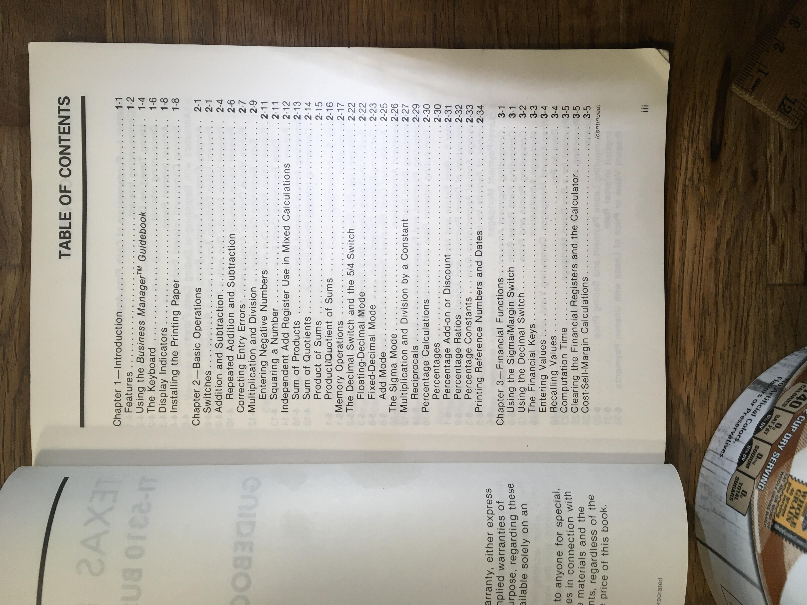

# Reference

This is a collection of reference information, including [measurements](#measurements), [reference images](#reference-images), [similar projects](#reference-projects), and [platforms and frameworks](#platforms) to implement.

## Measurements

* Page Height: 20.4 cm, 8 inches
* Page Width: 14.1 cm, 5.5 inches

* Cover Margins: 1cm, 3/8 inch (all sides)
* Cover Title "TI": 1cm, 3/8 inch
* Cover Title Device Subtitle: 6.5mm, 1/4 inch
* Cover Title Book Title: 7.5mm, 5/16 inch
* Cover Space between main title and book title: 2.2cm, 7/8 inch
* Cover Space between book title and graphic: 1.4cm, 9/16 inch
* Graphic Size: 12cm, 4 3/4 inch

* Spine Width: 20.4cm, 8 inches
* Spine Height: 1cm, 3/8 inch
* Spine Text: .35 cm, 5/32 inch
* Spine Margin top/bottom: .31 cm, 1/8"
* Spine Margin left/right: 1cm, 3/8 inch
* Text placement: [margin: 1cm][TI-5310 BUSINESS MANAGER: 7cm][space: 5cm][GUIDEBOOK: 3cm][space: 2.5cm][logo: 1cm][margin: 1cm]
* Columns (inside margin): roughly [2/3][1/3] or in 12 col notation [8][4] 

* Page Margin Top: .85cm, 5/16 inch
* Page Margin Bottom: .6cm, 1/4 inch
* Page Margin Left/Right: 1.8cm, 11/16th inch

* Header/Chapter Text Height: 3.5mm 1/8inch
* Header Margin Before Line: 3.5mm, 1/8inch
* Header Line Thickness: 0.1cm, 1/16th (a little less)
* Header Height total: 8.5mm, 5/16th
* Header Margin Bottom: 8.5mm 5/16th

* Section Title Total Height: 7mm, 
* Section Title Text Height: 2.5mm, 
* Section Title Text Margin (top/bottom): 2.25mm
* Section line thickness: .25mm
* Section Title Space between title and paragraph: 5mm

* Paragraph Text Height: 2mm
* Space Between Paragraphs: 2mm

* Table Header indent: 5mm 
* Small Italic text (continued): 1mm

* Footer Top Margin: 0.6cm, 1/4 inch
* Footer Text Height: 0.2cm, 3/32 inch
## Reference Projects

* https://github.com/pmarsceill/just-the-docs  (Jekyll)
* https://github.com/alex-shpak/hugo-book (Hugo)
* https://github.com/surjithctly/documentation-html-template (html)
* https://github.com/squidfunk/mkdocs-material (mkdocs)
* https://github.com/tomjoht/documentation-theme-jekyll (example of generating PDFs)
* https://github.com/johno/gatsby-theme-documentation (Gatsby)
* https://github.com/thegeeklab/hugo-geekdoc (Hugo, i like the mermaid integration)
* https://github.com/jhildenbiddle/docsify-themeable (docsify.js, nice front-page design)
* https://github.com/bep/docuapi (Hugo, API Docs)

* Zero Static, makes themes for Jekyll, Gatsby, and Hugo : https://www.zerostatic.io/ See Whisper and Winston themes

### Platforms

* Hugo
* Jekyll
* Gatsby
* Middleman
* Sphinx
* MkDocs
* AsciiDoc
* docsify.js
* Hexo
* HyperTemplates
* 
* Plain HTML (single page, vertically stacked)
* Plain HTML (multi page, cover, toc, index, and content layouts)
* Plain HTML (single page, ToC sidebar)

### CSS frameworks

https://github.com/troxler/awesome-css-frameworks#class-less

## Reference Images

This is a collection of reference images of the printed manual.

### Cover and Spine

### Title and Table of Contents

### Introduction Pages

### Content Pages

### Back Matter

